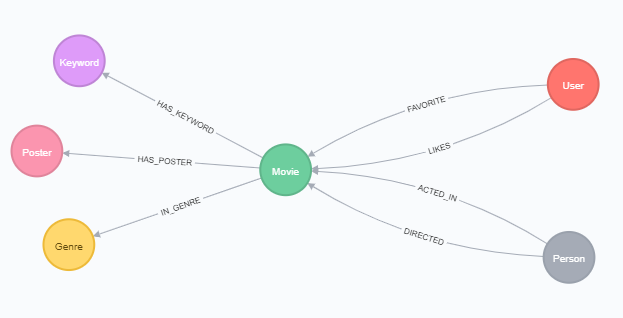
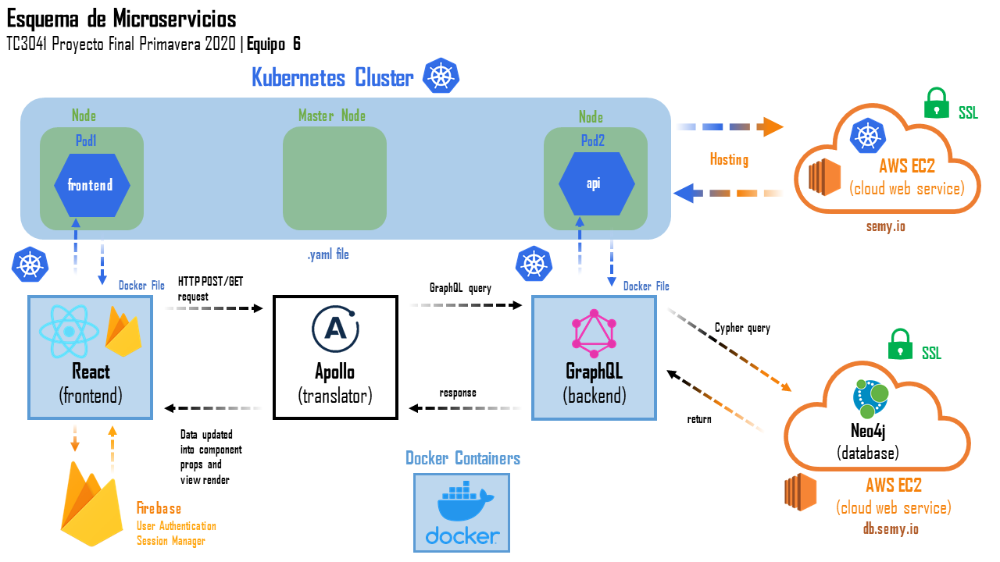

# TC3041 Proyecto Final Primavera 2020

# Sistema de recomendación de películas
---

##### Integrantes:
1. *Salomon Levy Becherano* - *A01023530* - *TEC SF*
2. *Sebastian Gonzalo Vives Faus* - *A01025211* - *TEC CSF*
3. *Luis Armando Ortiz Revilla* - *A01022320* - *TEC CSF*
4. *Luis Antonio García García* - *A01021865* - *TEC CSF*

---
## 1. Aspectos generales

Las orientaciones del proyecto se encuentran disponibles en la plataforma **Canvas**.

Este documento es una guía sobre qué información debe entregar como parte del proyecto, qué requerimientos técnicos debe cumplir y la estructura que debe seguir para organizar su entrega.

### 1.1 Requerimientos técnicos

A continuación se mencionan los requerimientos técnicos mínimos del proyecto, favor de tenerlos presente para que cumpla con todos.

* El equipo tiene la libertad de elegir las tecnologías de desarrollo a utilizar en el proyecto, sin embargo, debe tener presente que la solución final se deberá ejecutar en una plataforma en la nube. Puede ser  [Google Cloud Platform](https://cloud.google.com/?hl=es), [Azure](https://azure.microsoft.com/en-us/) o [AWS](https://aws.amazon.com/es/free/).
* El proyecto debe utilizar al menos dos modelos de bases de datos diferentes, de los estudiados en el curso.
* La solución debe utilizar una arquitectura de microservicios. Si no tiene conocimiento sobre este tema, le recomiendo la lectura [*Microservices*](https://martinfowler.com/articles/microservices.html) de [Martin Fowler](https://martinfowler.com).
* La arquitectura debe ser modular, escalable, con redundancia y alta disponibilidad.
* La arquitectura deberá estar separada claramente por capas (*frontend*, *backend*, *API RESTful*, datos y almacenamiento).
* Los diferentes componentes del proyecto (*frontend*, *backend*, *API RESTful*, bases de datos, entre otros) deberán ejecutarse sobre contenedores [Docker](https://www.docker.com/) y utilizar [Kubernetes](https://kubernetes.io/) como orquestador.
* Todo el código, *datasets* y la documentación del proyecto debe alojarse en este repositorio de GitHub siguiendo la estructura que aparece a continuación.

### 1.2 Estructura del repositorio
El proyecto debe seguir la siguiente estructura de carpetas:
```
- / 			        # Raíz de todo el proyecto
    - README.md			# Archivo con los datos del proyecto (este archivo)
    - app
        - frontend			# Carpeta con la solución del frontend (Web app)
        - api			# Carpeta con la solución de la API
    - datasets		        # Carpeta con los datasets y recursos utilizados (csv, json, audio, videos, entre otros)
    - dbs			# Carpeta con los modelos, catálogos y scripts necesarios para generar las bases de datos
```

### 1.3 Documentación  del proyecto

Como parte de la entrega final del proyecto, se debe incluir la siguiente información:

* Justificación de los modelo de *bases de datos* que seleccionaron.
* Descripción del o los *datasets* y las fuentes de información utilizadas.
* Guía de configuración, instalación y despliegue de la solución en la plataforma en la nube  seleccionada.
* Documentación de la API. Puede ver un ejemplo en [Swagger](https://swagger.io/). 
* El código debe estar documentado siguiendo los estándares definidos para el lenguaje de programación seleccionado.

## 2. Descripción del proyecto

El proyecto desarrollado consiste en una sistema de recomendación de película. El propóstio del sistema es descubrir nuevas peliculas a traves de tus gustos en otras películas que te hayan gustado. El sistema te pregunta qué películas te han gustado y cuáles no, en una interfaz similar a “Tinder”, en donde aparecen una tarjeta a la vez, conteniendo el nombre y póster de una película. El usuario puede hacer swipe a la derecha, izquierda, arriba o abajo. Cada acción tiene un significado diferente:
- Swipe a la derecha (botón like): Me gusta esta pelicula.
- Swipe a la izquierda (botón tache): Me disgusta esta película.
- Swipe hacia abajo (botón dismiss): No he visto esta película.
- Swipe hacia arriba (botón favorito): Película favorita (guardar película en favoritos).

Para modelar la solución se modelaron varios procesos de negocio para que el sistema fuera más interactivo. Los procesos que se modelaron consisten en :
- Creación de usuarios y login.
- Sesiones.
- Sistema de recomendaciones.
- Acciones sobre la película (Swipes).
- Lista de favoritos.
- Lista de todas las películas (filtrado por nombre, likes o género)
- Lista de usuarios (filtrado por similitud de gustos).


## 3. Solución

A continuación aparecen descritos los diferentes elementos que forman parte de la solución del proyecto.

### 3.1 Modelos de *bases de datos* utilizados

Los modelos que se usan en la solución son Neo4j y Firebase:

1. Neo4j como modelo de grafos fue la opción para modelar los nodos y relaciones principales de nuestro proyecto, el esquema que definimos para la solución es el siguiente:


El motivo por el cuál elegimos Neo4j es por el manejo de varios nodos y relaciones que pueden existir sin ser complicado, además de la alta disponibilidad, la rapidez de las consultas y sobre el query que manejamos para hacer la relación de que películas recomendará la aplicación.

2. Firebase es la base de datos que se encarga de nuestro registro y autenticación, al igual que el manejo de sesiones. El motivo por el cual elegimos Firebase como nuestro manejador de sesiones es por su sencilla instalación, uso y seguridad que provee a nuestra aplicación y usuarios.


### 3.2 Arquitectura de la solución



### 3.3 Frontend

Utilizamos Firebase para el registro, autenticación y manejo de sesiones para nuestros usuarios. Firebase tiene su propia nube donde se encarga de registrar y autenticar a los usuarios, generando una llave que nos regresa a nosotros. Utilizando rutas privadas, podemos confirmar si existe un usuario autenticado en la sesión, si sí, los dejamos entrar a la página principal, si no, los regresamos automáticamente al inicio de sesión.
- https://firebase.google.com/

Para visualizar nuestros componentes, utilizamos React, que se encarga de renderizar los componentes HTML, CSS, JS, al igual que las respuestas de GraphQl y los usuarios autenticados por Firebase. Descargamos la librería de @Material-UI para los componentes visuales de la aplicación.
- https://reactjs.org/
- https://material-ui.com/

#### 3.3.1 Lenguaje de programación
- Javascript
- Css
- JSON
- HTML
#### 3.3.2 Framework
- React
- Firebase
#### 3.3.3 Librerías de funciones o dependencias
- Node
- Material-UI
- Tindercards -https://www.npmjs.com/package/react-tinder-card

### 3.4 Backend

Utilizamos el API de Apollo como traductor entre los POST/GET que mandamos desde React hacia GraphQL, traduciendo los POST/GET a Cypher, los cuales puede utilizar GraphQL para comunicarse con la base de datos de Neo4j para recibir y subir información.

Escribimos los Cypher queries en el SCHEMA de GraphQL, donde tenemos cada componente del SCHEMA de la base de datos de Neo4j y sus Cyphers. Tambien tenemos Mutaciones (POST) y nuestros Queries (GET).

- https://graphql.org/
- https://www.apollographql.com/

#### 3.4.1 Lenguaje de programación
- JSON
- Javascript
#### 3.4.2 Framework
- GraphQL
#### 3.4.3 Librerías de funciones o dependencias
- Apollo

### 3.5 Arquitectura en la nube
La aplicación está compuesta por varios microservicios descritos previamente. Esta es la arquitectura de despliegue de los mismos.
#### 3.5.1 Base de datos Neo4j
Debido a que el servicio en la nube de Neo4j (Aura) es un servicio de paga, decidimos alojar la base de datos en una instancia EC2 de AWS. Ésta se encuentra en la liga https://db.semy.io:7473 y atiende a todas las peticiones de la aplicación. La comunicación se lleva a cabo mediante TLS (certificado obtenido con Let's Encrypt).
#### 3.5.2 Base de datos Firebase
Para el manejo de usuarios utilizamos el servicio de Firebase. No fue necesario desplegar una instancia ya que Google ofrece el servicio de manera gratuita.
#### 3.5.3 App
Como se mencionó anteriormente, la app se divide en microservicios incluyendo el Front end y el Back end. Para desplegarlos utilizamos [Kops](https://github.com/kubernetes/kops). Las imagenes de Docker creadas para la app se pueden encontrar en Docker Hub, [Front end](https://hub.docker.com/repository/docker/semylevy/movie-frontend) y [Back end](https://hub.docker.com/repository/docker/semylevy/movie-api). Kops nos permite desplegar la aplicacion en un cluster de Kubernetes, nuestra configuración cuenta con un nodo master y dos esclavos. La aplicación se distribuye en distintas instancias EC2 de AWS y el almacenamiento de lleva a cabo en Buckets de AWS S3. Utilizando un Load Balancer, el URL externo del frontend apunta a https://semy.io, donde la app puede ser utilizada.

### 3.6 Pasos a seguir para utilizar el proyecto
Existen dos formas de utilizar el proyecto, una de forma local y otra remota:

1. Hay que crear un directorio con el nombre que se desee, posterior abrir una terminal de docker y cambiarse a ese directorio y hacer un git clone de este repositorio. 
2. Ya clonado se debe ejecutar el siguiente comando : *cd tc3041-pf-primavera-2020-equipo6/app*.
3. Dentro de la carpeta, se ejecuta el comando *docker-compose build*.
4. Una vez instalado las imagenes en docker, utilizamos el comando *docker-compose up -d*.
5. (Nota) Si se está corriendo docker como una máquina virtual y no sabes su ip, usamos el comando *docker-machine ip*.
6. Ya que todos los contenedores esten corriendo, en el navegador de su preferencia ingresar a *localhost:3000* ó *<virtual-machine-ip>:3000*
7. (Adicional) si quieren probar los Cyphers de GraphQL, pueden ingresar a *localhost:4001* ó <virtual-machine-ip>:4001*

- La otra opción es usar el proyecto orquestado con kubernetes en la nube, para eso solamente ingresar a la liga https://semy.io

1. Una vez dentro de la aplicacion, seremos redirigidos la página de login, donde puedes ingresar a la aplicacion si tienes una cuenta.
2. Si no tienes una cuenta con la aplicacion, puede acceder a la pagina de Registro dandole click en "click here" donde seremos redirigidos a la pagina de *registro*.
3. Aqui sera necesario ingresar un *nombre de usuario*, una *cuenta de correo electronico VALIDA* y una contraseña de 6 caracteres como mínimo. 
4. Si todo está correcto nos redirige a la interfaz principal donde tendremos una carta con una película recomendada.
5. Tenemos 4 acciones con la tarjeta (las cuales llamaremos swipes) los cuales hacen lo siguiente dependiendo la direccion a donde muevas la tarjeta:
    5.1 *Swipe Izquierda*: Le das *Dislike* a la pelicula.
    5.2 *Swipe Arriba*: Agregas la pelicula tus favoritos.
    5.3 *Swipe Derecha*: Le das *Like* a la pelicula.
    5.4 *Swipe Abajo*: No has visto la pelicula.
    
6. En la pagina de Peliculas se encuentran todas las peliculas en la base de datos, donde podemos ver su nombre al igual que su numero de likes. Se puede filtrar por titulo y numero de likes. Tambien, tenemos un buscador que nos permite buscar cualquier pelicula por su titulo.

7. En la pagina de Usuarios se enceuntran todos los usuarios registrados en la aplicacion, al igual que la similaridad que tienen contigo (valor de -1 a 1) entre mas alto sea el valor, mas peliculas en comun tienen contigo y viceversa.
8. En la pagina de favoritos podemos ver todas las peliculas favoritas agegadas por el usuario, compartiendo las mismas funcionaidades que la pagina de Peliculas. Adicionalemnte, el usuario puede borrar cualquier pelicula favorito por si llega a cambiar de opinion.
9. Finalmente si deseamos cerrar sesión, únicamente se da click en la opción Signout y seremos redirigidos a la pantalla de login.

## 4. Referencias

- https://neo4j.com/graphacademy/online-training/data-science/
- https://auth0.com/
- https://neo4j.com/docs/graph-algorithms/current/labs-algorithms/jaccard/
- https://github.com/tec-csf/tc3041-pf-primavera-2020-equipo6
- http://guides.neo4j.com/sandbox/recommendations
- https://neo4j.com/developer/neo4j-cloud-aws-ec2-ami/?_ga=2.38760035.1125792768.1590423787-1046712168.1587386293
- http://techgenix.com/namecheap-aws-ec2-linux/
- https://medium.com/neo4j/getting-certificates-for-neo4j-with-letsencrypt-a8d05c415bbd
- https://community.neo4j.com/t/troubleshooting-connection-issues-to-neo4j/129
- https://kops.sigs.k8s.io/getting_started/aws/#cluster-state-storage
- https://www.digitalocean.com/community/tutorials/how-to-migrate-a-docker-compose-workflow-to-kubernetes
